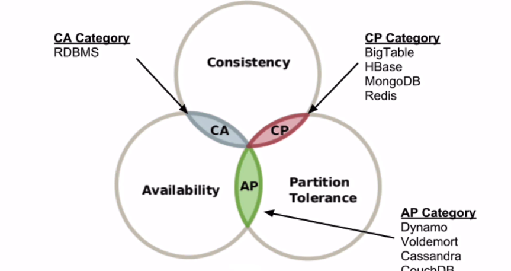
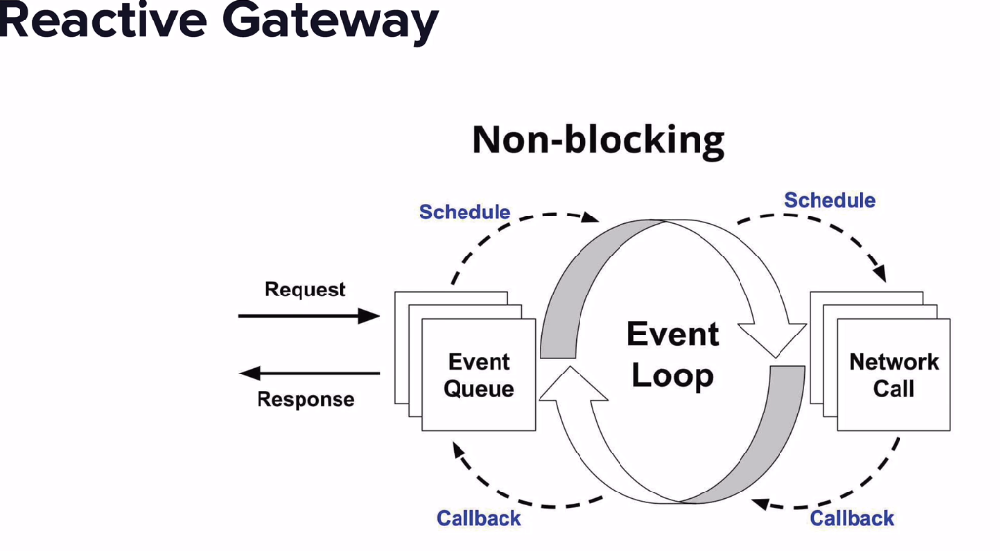
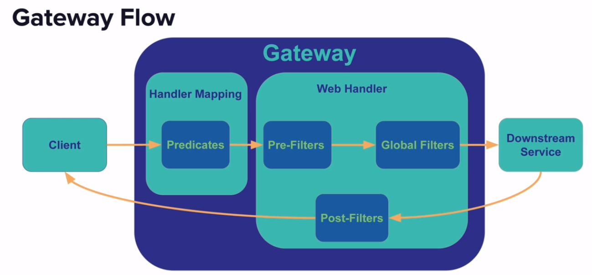
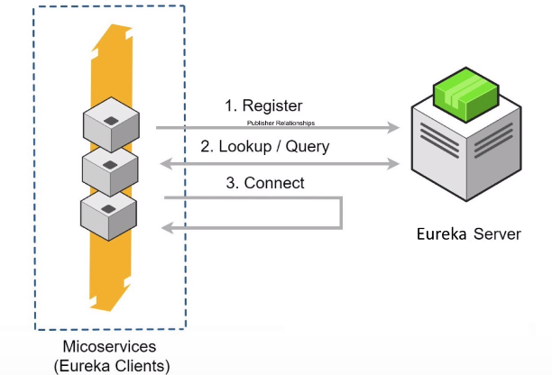
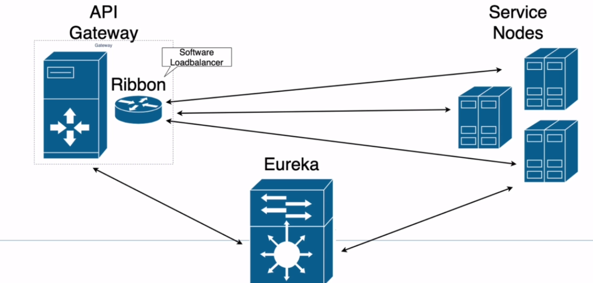
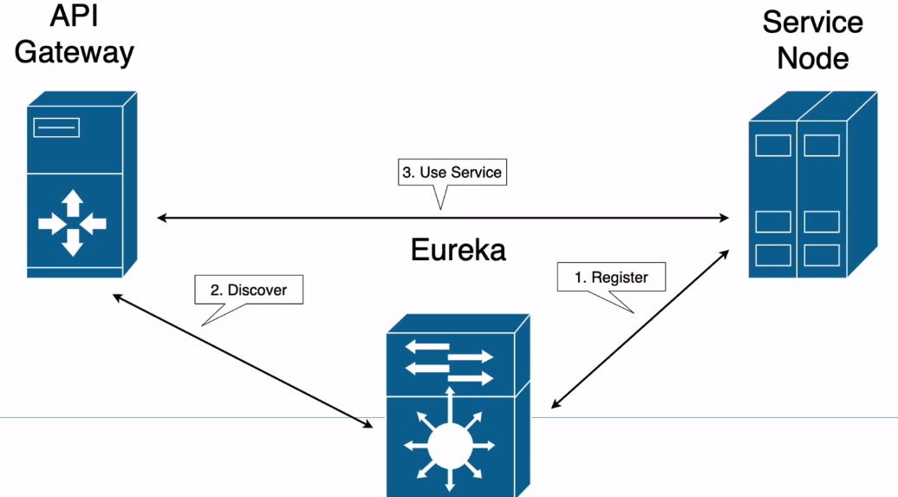

## Spring REST docs
- It generates documentation snippets from controller tests.
- AsciiDoctor assembles those snippets into a single document index.adoc
- Need to configure Spring MockMvc to work with Spring REST Docs.

## Jackson
### Common Jackson annotations:
- @JsonProperty - Allows to set the property name
- @JsonFormat - Gives control over how property is serialized (Useful for Dates)
- @JsonUnwrapped - Allows to flatten a property
- @JsonView - Allows to configure virtual view of objects
- @JsonManagedReference, @JsonBackReference - for mapping embedded items
- @JsonIdentityInfo - Allows to specify a property to determine object identity
- @JsonFilter - Used to specify programmatic property filter

### Serialization annotations:
- @JsonAnyGetter - Takes the map property and serializes the key to property names, values to 
values 
- @JsonGetter - Allows to identify the methods as a 'getter', which will be serialized into property
- @JsonPropertyOrder - Allows to set order of properties in serialized json output
- @JsonRawValue - Serializes the string value of the property as it is.
- @JsonValue - Used to mark the method for the serialization output. Will throw exception if more
 than one method is annotated
- @JsonRootName - Creates the root element for the object
- @JsonSerialize - Allows to specify the custom serializer

### Deserialization annotations:
- @JsonCreater - Used to identify the object constructor to use, and property annotations
- @JacksonInject - Allows to inject values into properties during during deserialization
- @JsonAnySetter - Converts the Json object into map object, where property names are keys of map
- @JsonSetter - Identifies a Java method to use as a setter for the identified json property
- JsonDeserialize - Allows to specify custom deserializer

### Other annotations:
- @JsonIgnoreProperties - Class level annotation used to tell Jackson to ignore one or more 
property 
- @JsonIgnore - Field level annotation used to tell Jackson to ignore one or more 
property 
- @JsonIgnoreType - Class level annotation used to ignore class
- @JsonInclude - Class level annotation used to control how null values are presented in 
serialization
- @JsonAutoDetect - Jackson will use reflection in serialization. It allows to tune which 
properties/methods are deducted

### Json Testing with Spring Boot
- Annotate the Test class with `@JsonTest`. This will inject the Spring Boot configured 
ObjectMapper.
- If we need different property naming strategy like kebab case, follow below steps:
    - create application-kebab.properties in resources directory under /test
    - set spring.jackson.property-naming-strategy=KEBAB_CASE
    - Annotate the test class with @ActiveProfiles("kebab")
 - If we set explicitly the property name using @JsonProperty, then this will override any naming
  strategy.
  
## Maven BOM(Bill Of Materials)
- Provides a common place to maintain all the dependencies so that all our microservices can 
inherit.
- Spring Parent POM is very similar to BOM. It provides us a set of dependencies and properties.
It doesn't set common dependencies, set common plugins, set common plugin configurations. But the
 BOM does.
 - In our application POM, we inherit from Spring Parent POM by explicitly mentioning them.
 - BOM Configurations:
    - Set common maven properties
    - Set common maven plugins and configurations
    - Set dependency versions
    - Set common dependencies
    - Set common build profiles
    - Set just any inheritable property that is common
    
## Spring State Machine
###State Machine
- State Machine can be defined as anything with a set of known states
- A 'State Machine' can be:
    - if-then-else statements
    - switch statements
- State Machine consists of:
    - Finite set of states
    - Set of Inputs
    - Initial state
    - Final state
    - Transition Function
- Common State Machine Use Cases
    - Message (Event) based applications
    - Events get published based on State changes
    - UI applications with Actions triggered by Use - Caps Lock On/Off
    - Application behaviour changes based on known states
- State Machine Terminology
    - States: The specific state of a State Machine. It is Finite and Predefined values. Mostly 
    declared as ENUM.
    - Events: Something that happens to the system - may or may not change the state.
    - Actions: The response of the State Machine to events. Can be changing the variables, 
    calling methods or changing to different state.
        - Transitions: Type of action which changes the state.
    - Guards: Boolean conditions which allow/disallow certain things happen.
    - Extended State: State Machine variables(in addition to state)
### Why use State Machine?
- State Machines help define consistent behaviour for finite of states.
- Application logic is defined for specific state or state transitions.
- Application logic becomes more modular and more precisely defined.
- Long block of if, then, else if conditions are difficult to code, debug and maintain.
- Helps to avoid spaghetti code for complex conditions.

##Using Sagas with Spring
### ACID Transactions
- Atomicity - All operations are completed successfully or DB is returned to previous state.
- Consistency - Operations do not violate system integrity constraints.
- Isolated - Results are independent of concurrent transactions.
- Durable - Results are made persistent in case of system failure.

### Distributed Transactions
- With microservices, often multiple services are involved in what is considered as Transaction.
- Java EE - Java Transaction API (JTA)
  - Enables distributed transactions in Java Environment.
  - Supported by Spring.
  - Transactions are managed across nodes by a Transaction Manager
  - Java Centric.
- Two Phase Commit - 2PC
  - Happens in 2 phases - Voting and Commit
  - Coordinator asks each node if proposed transaction is okay
    - If all Respond okay, then
      - Commit message is sent
      - Each node commits work and sends acknowledgement to coordinator
    - If any node responds no, then
      - Rollback message is sent
      - Each node rollbacks and sends acknowledgement to coordinator
  - Problems with 2PC
    - Does not scale - expensive
    - Blocking Protocol - the various steps block and wait for other to complete
    - Performance is limited to the speed of the slowest node
    - Coordinator is a Single Point Of Failure
    - Technology lock-in - can be difficult to mix technology stacks
### Challenges with Microservices
- A transaction for a Microservices Architecture often spans across multiple microservices.
- Each service have its own DB - could be SQL/NoSQL DB.
- Should be technology agnostic - services can be Java, NodeJs, Python, .NET, etc.
- How to coordinate the transaction across multiple microservices?
### Need for Sagas
#### CAP(Consistency, Availability, Partition Tolerance) Theorem
- Consistency - Every read will have most recent write.
- Availability - Each read will get a response, but without the guarantee data is most recent write.
- Partition Tolerance - System Continues in lieu of communications errors or delays.

CAP Theorem states a Distributed System can only maintain 2 of 3.

#### BASE - An ACID Alternative
- BASE - Basically Available, Soft State, Eventually Consistent.
- Opposite of ACID.
- Basically Available - Build System to support partial failures. Loss of some functionality Vs 
Total System loss.
- Soft State - Transactions cascade across nodes, it can be inconsistent for a period of time.
- Eventually Consistent - When processing is complete, system will be consistent.

#### Feral Concurrency Control
- It is application level mechanism for maintaining DB integrity.
- Relational DB can enforce variety of constraints - such as foreign key constraints.
- Not available within distributed system.
- Its upto application to enforce the constraints.

#### Introducing Sagas
- Originally it was addressing Long Lived Transactions (LLT) within a single DB.
- LLTs hold on to DB resources for an extended period of time.
- Sagas proposed breaking long complex transaction into a smaller more atomic transactions.
- Concept of compensating transactions to correct partial executions.

#### Sagas
- Sagas are simply a series of steps to complete a business process.
- Sagas coordinate the invocation of microservices via messages or requests.
- Sagas become a Transactional model.
- Each step of the Saga can be considered as a request.
- Each step of the Saga has a compensating transaction.
  - Semantically undo the effect of request.
  - Might not restore to exact previous state - but effectively the same.
  
#### Sagas Steps
- Each step should be a message or event to be consumed by a microservice.
- Steps are asynchronous.
- Within microservice, it's normal to use traditional database transactions.
- Each message(request) should be idempotent.
  - Meaning if same message/event is sent, there is no adverse effect on the system state.
- Each step has a compensating transaction to undo the actions.

##### Compensating Transactions
- Compensating Transactions:
  - Effectively become Feral Concurrency Control.
  - Are the mechanism used to maintain system integrity.
  - Should be idempotent.
  - Cannot abort - need to ensure proper execution.
  - Not the same as a rollback to the exact previous state.
    - Implements business logic for a failure event.

#### Sagas are ACD
- Atomic - All transactions are executed or compensated.
- Consistency 
  - Referential integrity  within a service by the local DB.
  - Referential integrity across services by the application - 'Feral Concurrency Control'.
- Durability - Persisted by DB of each microservice.

#### Sagas & Eventually Consistent
- BASE - Basically Available, Soft State, Eventually Consistent.
- During execution of Saga, System is in Soft State.
- Eventually Consistent - system will be consistent at the conclusion of Saga.
  - Consistency achieved by normal execution of Saga.
  - In the event of error, consistency achieved via compensating transactions.
   
#### Sagas coordination
- 2 approaches for Saga coordination
  - Choreography - Distributed decision making. Each actor decides next steps.
    - Implementation:
      - Implemented using events.
      - Each actor emits an event for the next step in the Saga.
      - Requires each actor to have logic about the Saga.
      - Each actor needs to know how to perform a compensating transaction.
        - Thus each actor has more coupling to other system components.
    - Benefits:
      - Simple loosely coupled.
      - Good for simpler Sagas.
    - Problems:
      - Cyclic dependencies.
      - Harder to understand - logic is spread out.
      - Components are more complex.
    
  - Orchestration - Centralized decision making. Central component decides next steps.
    - Step components do not decide next steps.
    - Implementation:
      - Central component directing other actors.
      - Central component maintains state for the Saga:
        - State Machine
        - Saga Execution Coordinator
        - Event Sourcing
      - Must take responsibility of completion of Saga - persist state to DB, use persistent 
      message queues, etc      
    - Benefits:
      - Logic is centralized and easier to understand.
      - Reduced coupling and better separation of concerns.
    - Problems:
      - Risk of over centralization - need to maintain focus on separation of concerns.
      
- Which to use?
  - Choreography - For smaller simple Sagas.
  - Orchestration - For larger more complex Sagas.

- How to implement?
  - Typically custom solution - wide variety of implementations.
  - Open Source / Commercial Solutions are emerging.
  
## Spring Cloud Gateway
### APIGateway
- Clients connect to APIGateway seamlessly and the implementation details of the services are 
hidden.
- APIGateway -> Multiple Load Balancers -> Each LB handles requests for specific microservice.
- Responsibilities:
  - Routing/ Dynamic Routing
  - Security
  - Rate Limiting
  - Monitoring/Logging
  - Blue/Green Deployments
  - Caching
  - Monolith Strangling
- Types of APIGateways
  - Appliances/Hardware - Example: F5
  - SAAS (Software As A Service) - Example: AWS ELB
  - Web Servers - Configured as Proxies
  - Developer Oriented - Example: Zuul (Netflix) or Spring Cloud APIGateway
  Note : Types can be combined 
  
### Spring Cloud Gateway Features
- Java 8+, Spring Framework 5, Spring Boot 2, project Reactor
- Non-blocking, HTTP 2 support, Netty
- Dynamic Routing
- Route Mapping on HTTP Request attributes
- Filters for HTTP Request and Response

 

## Netflix Eureka
- It is a Service Discovery and Registration Service
  - Service Registration
    - When a microservice instance starts, it registers itself with Eureka service
    - Provides host name, IP, port and service name
    - Spring Boot provides a starter for Eureka server and Eureka client
    - Both server and client will self configure for localhost properties
    - Important to configure service name in application.properties. This value is used to lookup
     the service in Eureka.
  - Service Discovery
    - Process of discovering the available service instances   
    - Spring Cloud Open Feign allows for easy service discovery between services. Works in 
    conjunction with Eureka and Ribbon.
    - Spring Cloud Gateway can be configured to lookup services in Eureka. Works in conjunction 
    with Ribbon to load balance requests. 

## Spring Cloud Circuit Breaker
- Circuit Breaker Pattern allows us to recover from errors
- If the service is unavailable or has unrecoverable errors, we can specify an alternative action
 using Circuit Breaker Pattern
- Services need to be durable in microservices environment
- Spring Cloud Circuit Breaker is a project which provides abstractions across several Circuit 
Breaker implementations. Thus our source code is not tied to specific implementation.
- Supported Circuit Breaker Implementations:
  - Netflix Hystrix
  - Resilience4J
  - Sentinel
  - Spring Retry
- Spring Cloud Gateway supports Netflix Hystrix and Resilience4J
- Gateway filters are used on top of the Spring Cloud Circuit Breaker APIs
- Netflix has placed Hystrix into maintenance mode. Spring suggests using Resilience4J.

## Spring Cloud Config
- **Spring Cloud Config Server**
- Provides externalized configuration for distributed environments
- provides RESTFul style API for Spring services to lookup configuration values
- Spring Boot Applications on startup obtain configuration values from Spring Cloud Config Server
- Properties can be global, application specific, profile specific
- Easily encrypt and decrypt properties
- Config server is a traditional spring mvc application
- Config server registers with Eureka server
- **Spring Cloud Config property Storage** options:
  - Git(Default) or SVN
  - File System
  - HashCorp's Vault
  - JDBC, Redis
  - AWS S3
  - CredHub 
- **Spring Cloud Config Client**
  - Spring Cloud Config client by default looks for a URL property
  - *spring.cloud.config.url* - default is http://localhost:8888
  - If using discovery client, client will look for service called **configserver**
  - Fail fast - optionally configure client to fail with exception if config server cannot be 
  reached
- Configuration resources:
  - application = spring.application.name
  - profile = Spring active profiles
  - label = spring.cloud.config.label
  
## Spring Cloud Sleuth
 **Distributed Tracing :**
- Transactions in microservices can span many services/instances and even data centers.
- Distributed tracing provides the tools to trace the transaction across services and nodes.
- Distributed tracing is used for 2 aspects:
  - Performance monitoring across steps
  - Logging / troubleshooting
 
 **Spring Cloud Sleuth :**
- Distributed tracing tool for Spring Cloud.
- Conceptually what happens:
  - Headers on HTTP requests or messages are enhanced with trace data
  - Logging is enhanced with trace data
  - Optionally trace data can be reported to **Zipkin**
 
 **Tracing Terminology :**
- Spring Cloud Sleuth uses terminology established by **Dapper**
- Dapper is the distributed tracing system created by Google for their productions systems
- **Span** - is a basic unit of work. Typically a send and receive of a message
- **Trace** - A set of spans for a transaction
- **cs / sr** - Client Sent / Server Received - aka the request
- **ss / cr** - Server Sent / Client Received - aka the response

 **Zipkin Server :**
- Zipkin is an open source project used to report distributed tracing metrics
- Information can be reported to Zipkin via HTTP or Kafka or RabbitMQ
- Zipkin is a Spring MVC project
  - Recommended to use binary distribution or docker image
  - Building your own is not supported
- Uses in-memory DB for development
- Cassandra or ElasticSearch should be used for production
- [Zipkin Docker image](https://hub.docker.com/r/openzipkin/zipkin)  

 **Logging Output :**
- LOG_LEVEL [Appname, TraceId, SpanId, Exportable]
- Exportable - should span be exported to Zipkin? (Programmatic configuration option) 

 **Logging Configuration :**
- Microservices typically will use consolidated logging
- Number of approaches available - its highly dependent on deployment environment
- To support consolidated logging, log data should be available in JSON
- Spring Boot by default uses logback, which is easy to configure for JSON output 

## Spring Cloud Security
- Spring Cloud configuration will store encrypted properties as:
  - {cipher}<your encrypted value here>
- When Spring Cloud Config client requests an encrypted property, the value is decrypted and 
presented to the client.
- Must set a symmetric key in the property ``encrypt.key`` - should prefer setting this as 
environment variable
- Asymmetric (public/private) keys are also supported.
- Spring Cloud Config provides endpoints for property encryption/decryption
  - POST  /encrypt => will encrypt body of post
  - POST  /decrypt => will decrypt body of post  