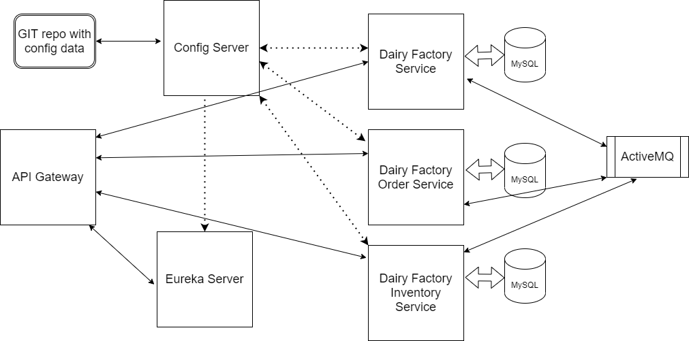
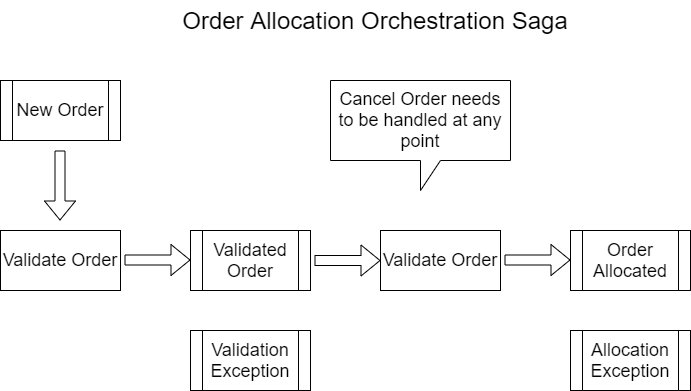

# dairy-factory
 (https://app.circleci.com/pipelines/github/mhnvelu/dairy-factory)

Spring Boot Microservices with Spring Cloud
----------
## Block Diagram

Below microservices have been implemented.

- [dairy-factory](https://github.com/mhnvelu/dairy-factory)
- [dairy-factory-order-service](https://github.com/mhnvelu/dairy-factory-order-service)
- [dairy-factory-inventory-service](https://github.com/mhnvelu/dairy-factory-inventory-service)
- [dairy-factory-inventory-failover-service](https://github.com/mhnvelu/dairy-factory-inventory-failover-service)
- [dairy-factory-gateway](https://github.com/mhnvelu/dairy-factory-gateway)
- [dairy-factory-eureka-server](https://github.com/mhnvelu/dairy-factory-eureka-server)
- [dairy-factory-config](https://github.com/mhnvelu/dairy-factory-config)
- [dairy-factory-config-server](https://github.com/mhnvelu/dairy-factory-config-server)

Please refer my [Notes](NOTES.md) to know about Sagas, Spring Cloud projects

A repository on Spring State Machine is available at [spring-state-machine-project](https://github.com/mhnvelu/spring-state-machine-project)

### Order Allocation Orchestration Saga

- Saga Execution Coordinator is implemented using Spring State Machine.
- Events:
  - VALIDATE_ORDER, VALIDATION_PASSED, VALIDATION_FAILED, ALLOCATION_SUCCESS, 
  ALLOCATION_NO_INVENTORY, ALLOCATION_FAILED, BUTTER_ORDER_PICKED_UP, CANCEL_ORDER
- States:
  - NEW, VALIDATED, VALIDATION_EXCEPTION, ALLOCATED, ALLOCATION_ERROR, PENDING_INVENTORY, 
  PICKED_UP, DELIVERED, DELIVERY_EXCEPTION, CANCELLED

### Running dairy factory microservices project
- Run the mysql container 1 [MySQL Docker](https://hub.docker.com/_/mysql)
  - docker run -d mysql
  - Connect to the mysql server and manually execute the script [mysql-init.sql](src/main/resources/scripts/mysql-init.sql). 
    This script creates the DB, DB User and Password.
- Run the JMS container
  - docker run -p 8161:8161 -p 8162:61616 vromero/activemq-artemis